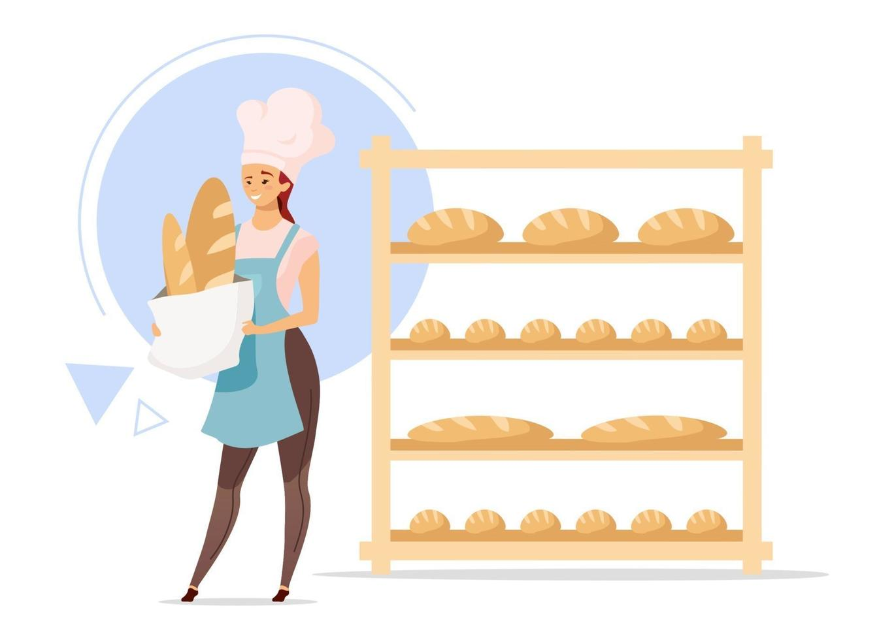
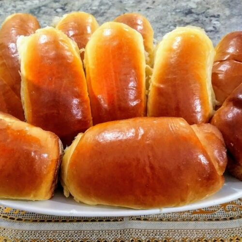

# 🥖 Padaria Artesanal Art

Bem-vindo ao repositório do site da **Padaria Artesanal Art** — uma padaria de bairro em São Paulo com foco em produtos artesanais, tradição familiar e atendimento acolhedor.

---

## 🌐 Página Inicial

### Seja bem-vindo à Padaria Artesanal Art!

Aqui, o cheirinho de pão quentinho encontra o calor de um bom papo. Somos uma padaria artesanal onde cada fornada é feita com tempo, cuidado e sabor.

Mais do que vender pães, queremos criar memórias. Seja no café da manhã com a família, no lanche da tarde ou naquele encontro rápido na calçada, nossa padaria é um ponto de encontro para quem aprecia simplicidade, afeto e tradição.

A padaria foi fundada em **2010**, pela minha mãe, **Dona Teresa**. Nosso carro-chefe é o **pão de queijo caseiro**.

---

### 📽️ Vídeo Institucional

> Uma breve demonstração do nosso café:

---

## 🥐 Nossos Produtos

### 🥖 Pães

| Categoria           | Produto                   | Descrição breve                        | Preço   | Imagem                                   |
|---------------------|---------------------------|----------------------------------------|---------|------------------------------------------|
| Pães Artesanais     | Pão de Fermentação Natural| Integral, multigrãos, com nozes        | R$ 8,00 |               |
| Pães Tradicionais   | Pão Francês               | Crocante por fora, macio por dentro    | R$ 0,80 |  |
| Pães Especiais      | Pão de Azeitona           | Com pedaços de azeitona preta          | R$ 7,50 | |
| Pães Doces          | Pão de Leite              | Fofinho e levemente adocicado          | R$ 1,20 |     |
| Pães Integrais      | Pão Integral com Sementes | Com chia, linhaça e aveia              | R$ 9,00 |     |

---

### 🍰 Doces

| Categoria   | Produto                  | Descrição breve                       | Preço   | Imagem                                   |
|-------------|--------------------------|---------------------------------------|---------|------------------------------------------|
| Doces       | Croissant com Chocolate  | Massa folhada leve, estilo francês   | R$ 9,00 |  |
| Sobremesas  | Brownie Artesanal        | Com pedaços de chocolate belga       | R$ 6,50 |      |

---

### 🥤 Bebidas

| Categoria         | Produto              | Descrição breve                                 | Preço   | Imagem                                  |
|-------------------|----------------------|--------------------------------------------------|---------|-----------------------------------------|
| Bebidas Quentes   | Cappuccino Artesanal | Com leite vaporizado e canela                   | R$ 7,00 |    |
| Bebidas Geladas   | Coca-Cola            | Refrigerante com sabor único e refrescante      | R$ 5,00 |        |
| Bebidas Naturais  | Sucos Naturais       | Feitos na hora com frutas frescas da estação    | R$ 7,00 |                |

---

## 🌟 Diferenciais

- 🥖 O pão quentinho que sua manhã merece  
- 👩‍🍳 Produção artesanal de verdade  
- 📜 Receitas de família ou tradicionais  
- 🕐 Produtos fresquinhos o dia todo  
- 🤝 Atendimento próximo e acolhedor  

---

### 🎞️ Apresentação em Vídeo

---

## 🕒 Horários de Funcionamento

| Dias                 | Horários          |
|----------------------|-------------------|
| Segunda-feira        | **Fechado**       |
| Terça-feira a Domingo| 6:30 às 19h       |
| Feriados             | **Não abrimos**   |

☕ Espaço para café no local.

---

## 📍 Localização

**Endereço:** Rua das Mangueiras, 118 - Bairro Jardim das Flores, São Paulo/SP

---

## 📄 Licença

&copy; **2025 Padaria Artesanal Art**. Todos os direitos reservados.

---

## 💡 Informações Adicionais

- Este site é uma demonstração de uma padaria fictícia com fins de aprendizado ou apresentação.
- Todas as imagens estão armazenadas localmente na pasta `assets/`.
- O projeto pode ser visualizado localmente ao abrir `index.html` em um navegador moderno.

---

## 🧰 Tecnologias

- HTML5
- CSS3
- Google Fonts (`Open Sans`)
- Vídeo MP4 local
- YouTube (embed)
